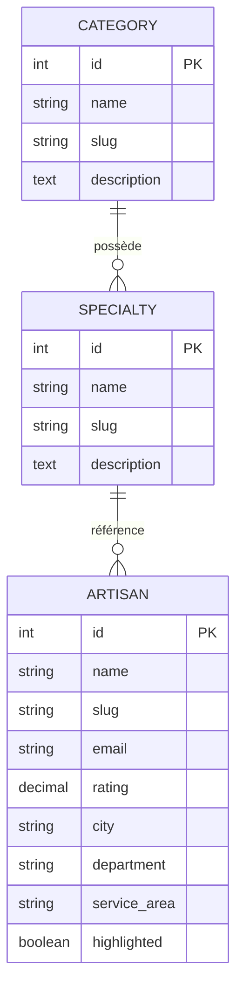

# Trouve ton artisan – Dossier de conception

## Page de garde
- **Projet :** Trouve ton artisan – Région Auvergne-Rhône-Alpes
- **Équipe :** Studio numérique (contact à compléter)
- **Date :** JJ/MM/AAAA
- **Version :** 1.0.0

---

## Sommaire
1. [Contexte du projet](#contexte-du-projet)
2. [Expression des besoins](#expression-des-besoins)
3. [Contraintes et objectifs](#contraintes-et-objectifs)
4. [Livrables attendus](#livrables-attendus)
5. [Maquettes Figma](#maquettes-figma)
6. [Architecture de l'application](#architecture-de-lapplication)
7. [Base de données](#base-de-données)
8. [Sécurité](#sécurité)
9. [Veille cybersécurité](#veille-cybersécurité)
10. [Liens utiles](#liens-utiles)

---

## Contexte du projet
La région Auvergne-Rhône-Alpes souhaite proposer un portail unique pour valoriser l'artisanat local. La plateforme doit permettre aux particuliers de rechercher un artisan qualifié, découvrir son profil et le contacter via un formulaire sécurisé. Les bureaux lyonnais pilotent le projet.

## Expression des besoins
- **Recherche ciblée** d'artisans par catégorie, spécialité ou nom.
- **Navigation mobile-first** avec accessibilité conforme à WCAG 2.1 niveau AA.
- **Gestion des contenus** : catégories, spécialités, fiches artisans et pages légales.
- **Formulaire de contact** envoyant un email à chaque artisan.
- **Sélection éditoriale** : mise en avant des « artisans du mois ».
- **Page 404 dédiée** et routage côté client.

## Contraintes et objectifs
- Respect de l'identité visuelle de la région (couleurs, logo, police Graphik).
- Sécurisation de l'API (clé d'API, rate limiting, validation des entrées).
- Conformité RGPD pour les données personnelles collectées.
- Hébergement prévu sur une infrastructure compatible Node.js et MySQL.
- Code source versionné sur GitHub et déployable via intégration continue.

## Livrables attendus
- Maquettes haute-fidélité (mobile, tablette, desktop).
- Application React + Bootstrap + Sass.
- API Node.js/Express connectée à MySQL via Sequelize.
- Scripts SQL de création et d'alimentation de la base.
- Documentation d'installation et d'exploitation.
- Rapport de sécurité et veille continue.
- Site déployé en production (URL à renseigner).

## Maquettes Figma
| Vue | Description | Lien |
| --- | ----------- | ---- |
| Mobile | Navigation principale, carte artisan, fiche artisan | https://www.figma.com/file/EXEMPLE/trouve-ton-artisan?node-id=1-1 |
| Tablette | Accueil et annuaire optimisés | https://www.figma.com/file/EXEMPLE/trouve-ton-artisan?node-id=2-1 |
| Desktop | Accueil, annuaire, fiche artisan, pages légales | https://www.figma.com/file/EXEMPLE/trouve-ton-artisan?node-id=3-1 |

> Remplacer les URL par les liens définitifs des maquettes validées.

## Architecture de l'application
```
trouve-ton-artisan/
├── frontend/        # Application React, React Router, Bootstrap & Sass
├── backend/         # API Express, sécurité, envoi d'emails
├── database/        # Scripts SQL (schema + seed)
└── docs/            # Documentation projet (PDF à générer depuis ce dossier)
```

### Découpage fonctionnel
- **Frontend** : pages (Accueil, Annuaire, Fiche artisan, How-to, Pages légales, 404), composants (Header, Footer, cartes, etc.), services d'accès API.
- **Backend** : routes REST `/api/categories`, `/api/artisans`, `/api/artisans/:slug/contact`, middleware d'authentification, validation, logs, rate limiting.
- **Infrastructure** : MySQL avec tables `categories`, `specialties`, `artisans` et relations 1-n.

## Base de données

### Modèle Conceptuel (MCD)


### Modèle Logique (MLD)
- `categories(id PK, name, slug UNIQUE, description)`
- `specialties(id PK, name, slug UNIQUE, description, category_id FK -> categories.id)`
- `artisans(id PK, name, slug UNIQUE, email, phone, rating, short_description, description, city, department, service_area, cover_image_url, website, highlighted, specialty_id FK -> specialties.id)`

## Sécurité
Mesures implémentées :
1. **Clé d'API obligatoire** via en-tête `X-API-KEY` pour toutes les routes `/api`.
2. **Rate limiting** (100 requêtes / 15 min par IP) avec `rate-limiter-flexible`.
3. **Helmet** pour durcir les en-têtes HTTP.
4. **Validation** des payloads via `express-validator`.
5. **Logs** d'accès HTTP (Morgan) pour l'audit.
6. **CORS contrôlé** (origine configurée via `CLIENT_URL`).
7. **Gestion des secrets** par fichiers `.env` non versionnés.
8. **Transport sécurisé** des emails via Nodemailer (authentification SMTP).
9. **Protection contre les payloads volumineux** (limite 100 Ko sur `express.json`).
10. **Sanitisation des erreurs** retournant des messages génériques côté client.

Chaque mesure est détaillée dans le README avec instructions de mise en œuvre.

## Veille cybersécurité
- **Sources surveillées :** CERT-FR, ANSSI, newsletter Snyk, dépendances `npm audit` hebdomadaire.
- **Vulnérabilités notables :** suivi des CVE liées à Express, Sequelize et Nodemailer.
- **Actions correctives potentielles :** mise à jour automatisée via Renovate, revues de dépendances, tests d'intégration sécurisés.

## Liens utiles
- **Repository GitHub :** https://github.com/<<organisation>>/trouve-ton-artisan
- **Déploiement de recette :** https://recette.trouve-ton-artisan.fr (à compléter)
- **Déploiement de production :** https://www.trouve-ton-artisan.fr (à compléter)
- **Documentation API (Swagger) :** /docs/api (à ajouter si nécessaire)

---

### Pied de page
> Région Auvergne-Rhône-Alpes – Direction du numérique – 101 cours Charlemagne, CS 20033, 69269 LYON CEDEX 02, France – Tél. +33 (0)4 26 73 40 00
